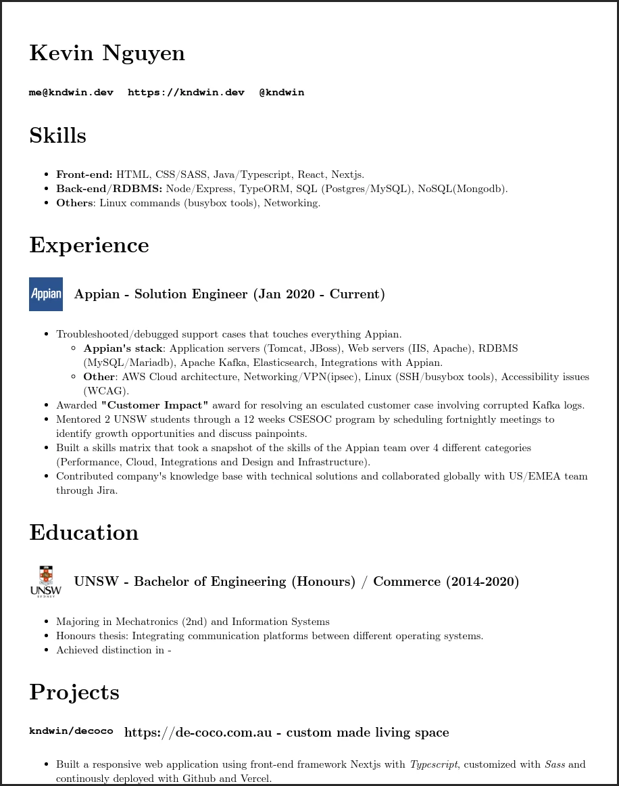

# Resume
Latex-style resume with Markdown-like syntax.

## How to run
Make sure you have `npm` installed.
1. `git clone https://github.com/kndwin/resume`
2. `cd resume && npm install`
3. `npm start`

Edit the `src/resume.md` file to your preference and the markdown file will get parsed similiarly like this image below.


## Configuring the CSS
- Open `src/resume.css` and start editing.

## Adding page breaks
- To add custom page breaks, in your markdown file add the following html 
  (make sure in the `src/resume.css` you don't use `display: flex;`)
```html
<div style="page-break-before: always"></div>
<div style="page-break-after: always"></div>
```

## Printing the resume
- To print, press `Ctrl+P` on either Firefox or Chrome and follow the printing instructions.
