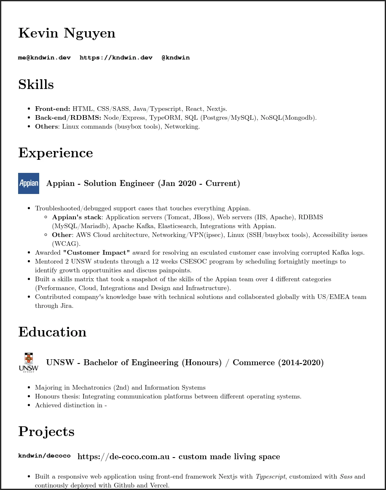

# Resume
A markdown parser that converts `.md` to `html` with Latex-like styling.

## How to run
Make sure you have `npm` installed.
1. `git clone https://github.com/kndwin/resume`
2. `cd resume && npm install`
4. `npm start`

Edit the `.md` file to your preference and the markdown file will get parsed similiarly like this image below.

